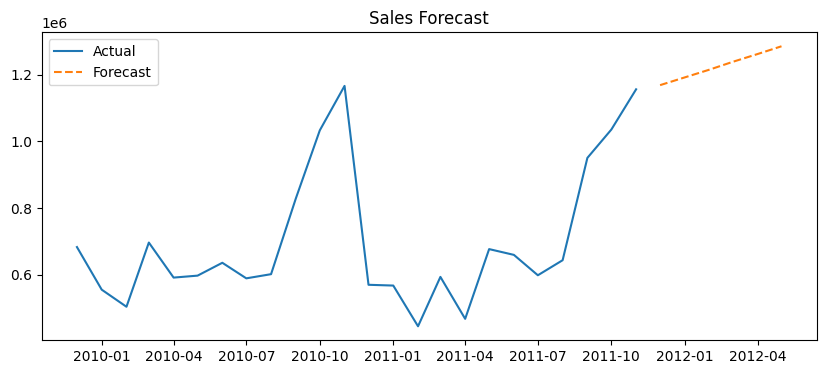

# Sales Forecasting and Customer Segmentation Dashboard

An end-to-end analytics project that cleans a real retail dataset, segments customers using RFM analysis and K-Means clustering, forecasts monthly sales, and presents the results in an interactive Tableau dashboard.

**Live dashboard:** [View on Tableau Public](https://public.tableau.com/views/SalesForecastingandCustomerSegmentationDashboard/Dashboard1)


## Problem Statement

A retailer wants to know which customers generate the most revenue, which customers are drifting away, and what sales might look like in the coming months. This project answers those questions using historical transaction data.

## Dataset

- **Online Retail II** (UCI Machine Learning Repository / Kaggle)
- Transactions from a UK-based online retailer, December 2009 to December 2011
- Columns: Invoice, StockCode, Description, Quantity, InvoiceDate, Price, Customer ID, Country

## Tools and Technologies

- **Python:** pandas, NumPy, scikit-learn, statsmodels, matplotlib
- **Google Colab** for the notebook
- **Tableau Public** for the dashboard
- **Git and GitHub** for version control

## Approach

1. **Data cleaning**
   - Removed rows with no Customer ID, cancelled orders (invoices starting with "C"), and rows with zero or negative quantity or price
   - Removed duplicates and converted dates
   - Created a `TotalPrice` column (Quantity x Price)

2. **RFM analysis**
   - **Recency:** days since the customer's last purchase
   - **Frequency:** number of unique orders
   - **Monetary:** total amount spent

3. **Customer segmentation**
   - Applied a log transform and standard scaling to the RFM values
   - Used K-Means clustering with 4 clusters
   - Labelled the clusters as **Champions, Loyal, At Risk, and Lost** by comparing the average RFM values of each cluster

4. **Sales forecasting**
   - Aggregated revenue by month
   - Fitted an exponential smoothing model (statsmodels) on the monthly series
   - Tested it on the last 3 months and forecast the next 6 months

5. **Dashboard**
   - Built three views in Tableau Public: customers per segment, revenue per segment, and actual vs forecast sales

## Key Findings

| Segment | Customers | Revenue |
|---|---|---|
| Champions | 1,196 (about 20%) | 12,834,471 (about 74%) |
| Loyal | 1,459 | 2,842,867 |
| At Risk | 1,250 | 1,071,864 |
| Lost | 1,973 | 625,602 |
| **Total** | **5,878** | **17,374,804** |

- **Champions are about 20% of customers but generate about 74% of total revenue**, so retaining them matters most.
- **Lost customers are the largest group (1,973) but bring in only about 4% of revenue.**
- Sales peak every November, which points to holiday-season demand.
- Forecast accuracy on the 3-month test set: **MAPE = X%** *(replace X with your value)*.

## Forecast



## Limitations

- The dataset covers only about two years, which is too short to learn a reliable yearly seasonal pattern. The forecast may overestimate sales after the November peak.
- Segments come from unsupervised clustering, so the labels are interpretations of the cluster averages, not ground truth.
- The data is from a single UK retailer and may not generalise to other businesses.

## Future Improvements

- Try SARIMA or Prophet once more history is available
- Add product-level analysis and country-level filters
- Add a churn prediction model for the At Risk segment
- Automate the pipeline and refresh the dashboard on a schedule

## Project Structure

```
sales-forecasting-dashboard/
├── data/                 # cleaned data and model outputs (CSV)
├── notebooks/            # Google Colab notebook (.ipynb)
├── images/               # dashboard and forecast screenshots
├── dashboard/            # dashboard files
└── README.md
```

## How to Run

1. Download the **Online Retail II** dataset from Kaggle or UCI.
2. Open the notebook in `notebooks/` in Google Colab.
3. Upload the dataset, then run the cells in order. This produces `clean_sales.csv`, `customer_segments.csv`, and `sales_forecast.csv`.
4. Open the Tableau Public link above, or connect Tableau to the CSV files in `data/`.

## Author

**Pradeeksha N**
B.Tech, Electronics and Communication Engineering, Karunya Institute of Technology and Sciences
[LinkedIn](https://www.linkedin.com/) | pradeekshaceeni@gmail.com
